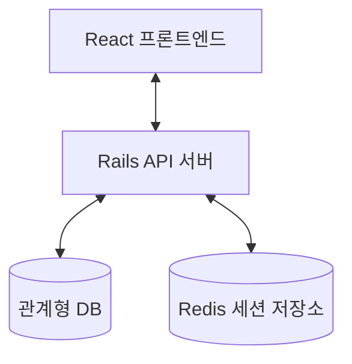
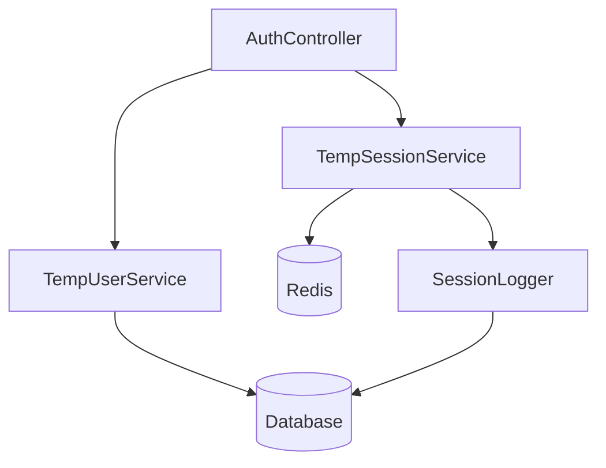
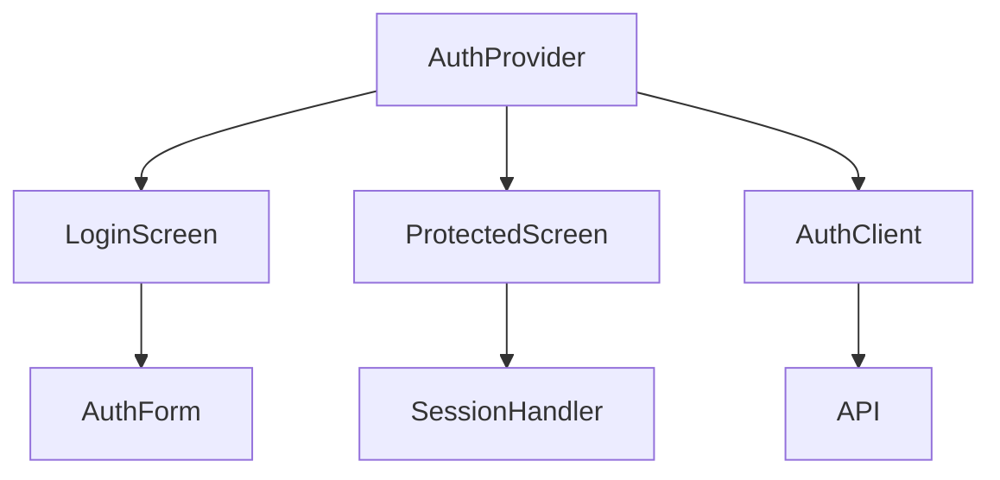
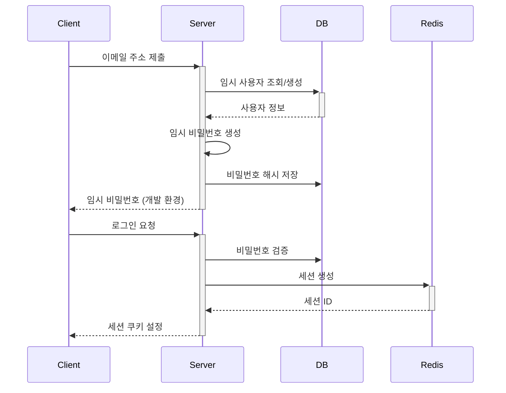
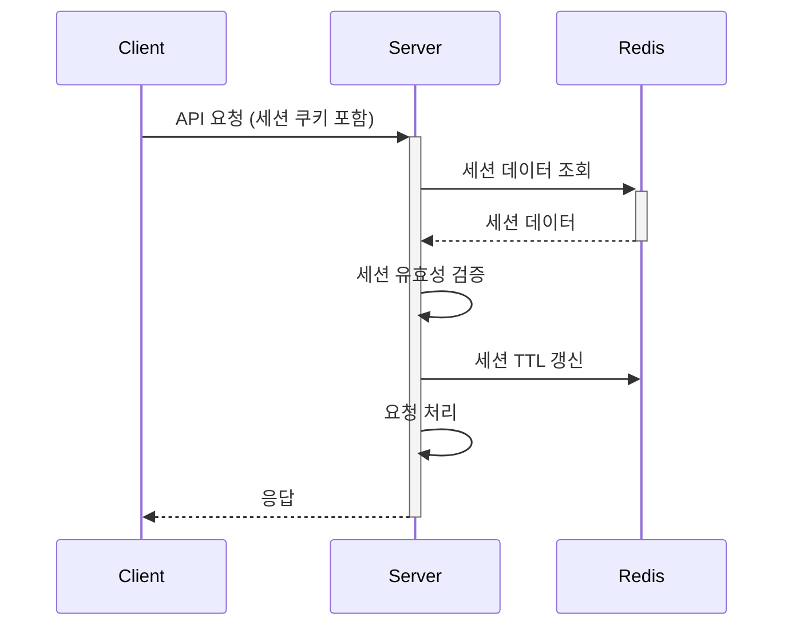

# 시스템 패턴: 임시 유저 인증 시스템

## 아키텍처 개요

### 전체 시스템 구조


### 주요 컴포넌트
- **프론트엔드**: React 기반 SPA
- **백엔드**: Rails API 서버
- **데이터 저장소**: 관계형 DB + Redis

## 핵심 디자인 패턴

### 인증 패턴
- **임시 비밀번호 기반 인증**: 이메일 주소로 임시 비밀번호 생성 및 검증
- **세션 기반 상태 관리**: Redis를 활용한 세션 데이터 저장 및 관리
- **핑거프린트 검증**: 세션 하이재킹 방지를 위한 사용자 환경 식별

### 데이터 접근 패턴
- **멀티 테넌시**: 회사(Company)와 거래처(Partner) ID 기반 데이터 분리
- **컨텍스트 기반 접근 제어**: 사용자 세션의 컨텍스트에 따른 데이터 필터링

### 상태 관리 패턴
- **중앙 집중식 상태 관리**: React Context API를 활용한 인증 상태 관리
- **세션 TTL 관리**: Redis TTL 기능을 활용한 세션 만료 처리

## 주요 컴포넌트 관계

### 백엔드 컴포넌트


### 프론트엔드 컴포넌트


## 핵심 기술 결정

### 세션 관리 전략
- **Redis 사용 이유**:
  - 빠른 읽기/쓰기 성능
  - TTL 기능 내장
  - 분산 환경 지원 가능성
- **세션 데이터 구조**: 해시 맵 형태로 필요한 정보만 저장
- **세션-사용자 매핑**: 동일 사용자의 중복 로그인 관리를 위한 매핑 유지

### 보안 강화 전략
- **핑거프린트 생성 방식**: IP, 사용자 에이전트, 브라우저 특성 조합
- **세션 ID 생성**: 충분한 엔트로피를 가진 랜덤 문자열 사용
- **쿠키 보안 설정**: HTTPOnly, Secure, SameSite 속성 적용

### 로깅 전략
- **세션 활동 로깅**: 모든 세션 생성, 종료, 갱신 이벤트 기록
- **비정상 활동 탐지**: 핑거프린트 불일치, 비정상적 접근 패턴 로깅

## 확장성 고려사항

### 수평적 확장
- **Redis 클러스터**: 세션 데이터 증가 시 Redis 클러스터로 확장 가능
- **API 서버 확장**: 무상태 설계로 여러 API 서버 인스턴스 운영 가능

### 기능적 확장
- **인증 방식 확장**: 기존 구조를 유지하며 다양한 인증 방식 추가 가능
- **권한 시스템 통합**: 세션 데이터에 권한 정보 추가로 확장 가능

## 주요 프로세스 흐름

### 임시 비밀번호 생성 및 로그인


### 세션 검증 및 갱신


### 중복 로그인 처리
```mermaid
sequenceDiagram
    Client2->>+Server: 로그인 요청 (기존 사용자)
    Server->>+Redis: 기존 세션 확인
    Redis-->>-Server: 기존 세션 ID
    Server->>Redis: 기존 세션에 강제 종료 플래그 설정
    Server->>+Redis: 새 세션 생성
    Redis-->>-Server: 새 세션 ID
    Server->>DB: 세션 로그 업데이트
    Server-->>-Client2: 새 세션 쿠키 설정
    Client1->>+Server: API 요청 (기존 세션)
    Server->>+Redis: 세션 데이터 조회
    Redis-->>-Server: 강제 종료 플래그 포함 데이터
    Server-->>-Client1: 세션 종료 응답
