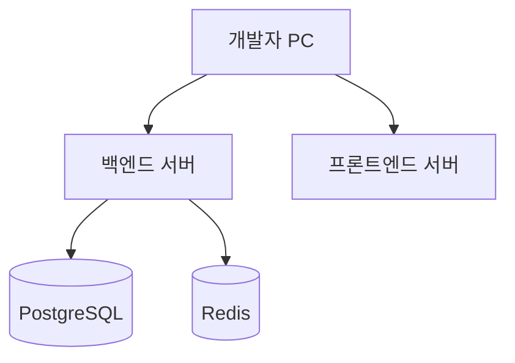

# 기술 컨텍스트: 임시 유저 인증 시스템

## 기술 스택

### 백엔드
- **프레임워크**: Ruby on Rails 7.x (API 모드)
- **언어**: Ruby 3.x
- **데이터베이스**: PostgreSQL (기본 설정)
- **세션 저장소**: Redis
- **인증 라이브러리**: bcrypt (비밀번호 해싱)

### 프론트엔드
- **프레임워크**: React 18.x
- **언어**: TypeScript
- **상태 관리**: React Context API
- **빌드 도구**: Vite
- **스타일링**: CSS (필요에 따라 확장 가능)

### 개발 환경
- **버전 관리**: Git
- **패키지 관리**:
  - 백엔드: Bundler
  - 프론트엔드: npm/bun
- **컨테이너화**: Docker (개발 및 배포 환경)

## 기술적 제약사항

### 성능 요구사항
- 인증 프로세스 응답 시간: 3초 이내
- 세션 검증 응답 시간: 100ms 이내
- 동시 사용자 지원: 초기 단계에서 최소 100명

### 보안 요구사항
- 비밀번호 해싱: bcrypt (비용 인자 12 이상)
- 세션 ID: 충분한 엔트로피를 가진 랜덤 문자열
- 쿠키 보안: HTTPOnly, Secure, SameSite=Lax
- CORS 설정: 허용된 도메인만 접근 가능

### 호환성 요구사항
- 브라우저 지원: 최신 2개 버전의 주요 브라우저
- 모바일 대응: 반응형 디자인 (추후 구현)

## 개발 설정

### 로컬 개발 환경

### 개발 워크플로우
1. 로컬 환경에서 백엔드 및 프론트엔드 서버 실행
2. 백엔드 API 개발 및 테스트
3. 프론트엔드 컴포넌트 개발 및 통합
4. 통합 테스트

### 환경 변수 설정
- **백엔드**:
  - `REDIS_URL`: Redis 연결 문자열
  - `DATABASE_URL`: 데이터베이스 연결 문자열
  - `SECRET_KEY_BASE`: Rails 암호화 키
  - `CORS_ORIGINS`: 허용된 오리진 목록
- **프론트엔드**:
  - `VITE_API_URL`: 백엔드 API 기본 URL

## 의존성 및 라이브러리

### 백엔드 주요 의존성
- **redis**: Redis 클라이언트
- **bcrypt**: 비밀번호 해싱
- **rack-cors**: CORS 설정
- **jbuilder**: JSON 응답 구성
- **rspec-rails**: 테스트 프레임워크

### 프론트엔드 주요 의존성
- **axios**: HTTP 클라이언트
- **react-router-dom**: 라우팅
- **js-cookie**: 쿠키 관리
- **vitest**: 테스트 프레임워크

## 배포 전략

### 개발 단계 배포
- Docker Compose를 활용한 로컬 개발 환경
- 필요에 따라 개발 서버 배포

### 향후 프로덕션 배포 고려사항
- 컨테이너 오케스트레이션 (Kubernetes 등)
- 로드 밸런싱 및 고가용성 설정
- Redis 클러스터 구성
- 모니터링 및 로깅 시스템 통합

## API 문서화

### API 엔드포인트 문서화 방식
- OpenAPI/Swagger 스펙 활용
- 엔드포인트, 파라미터, 응답 형식 문서화
- 인증 요구사항 명시

### 내부 API 구조
- RESTful API 설계 원칙 준수
- JSON 응답 형식 표준화
- 오류 응답 형식 일관성 유지

## 테스트 전략

### 백엔드 테스트
- 단위 테스트: 모델, 서비스 로직
- 통합 테스트: 컨트롤러, API 엔드포인트
- 보안 테스트: 인증 및 세션 관리

### 프론트엔드 테스트
- 컴포넌트 테스트: 개별 UI 컴포넌트
- 통합 테스트: 인증 흐름, 사용자 시나리오
- E2E 테스트: 주요 사용자 여정

## 모니터링 및 로깅

### 로깅 전략
- 구조화된 로그 형식 (JSON)
- 로그 레벨 구분 (debug, info, warn, error)
- 세션 활동 및 보안 이벤트 중점 로깅

### 모니터링 계획
- API 응답 시간 모니터링
- 세션 생성/만료 지표 추적
- 비정상 로그인 시도 알림
